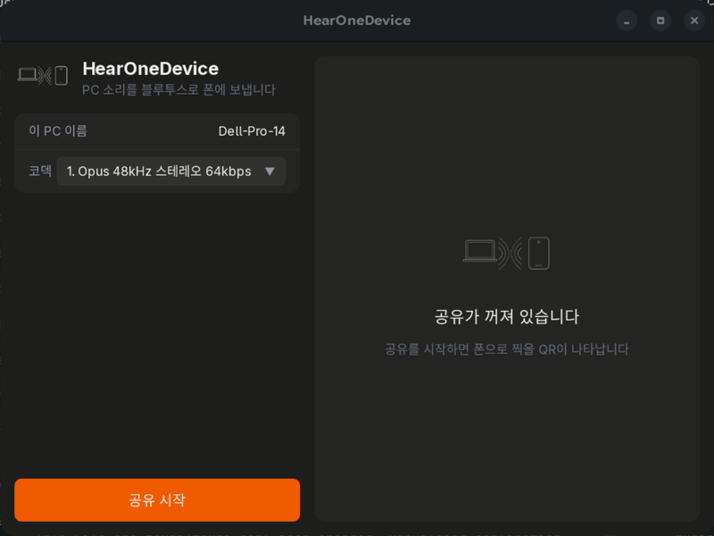
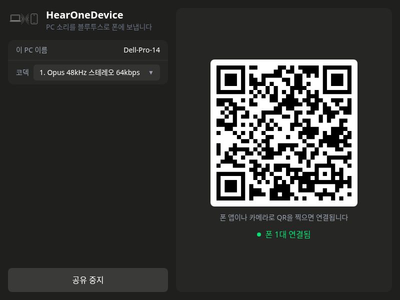

# PC 앱 화면 기록

바꾸기 전 화면을 캡처해 `images/ui/`에 남긴다. 새 항목은 아래에 추가.

## 2026-10-07 가로 4:3 두 칸 (`caaafb4`)

창 800×600. 왼쪽: 헤더·PC 이름·코덱·맨 아래 버튼 / 오른쪽: QR·연결 상태 카드. 640px보다 좁으면 위아래로 쌓임.
사용자 평가: 애매함 (왼쪽 칸 가운데가 비고 오른쪽 카드가 휑함).

| 공유 꺼짐 (실제 앱) | 공유 중 (가짜 데이터, 브라우저) |
|---|---|
|  |  |
